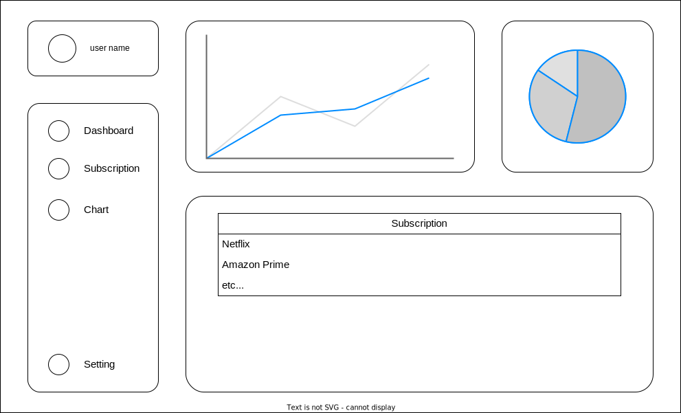
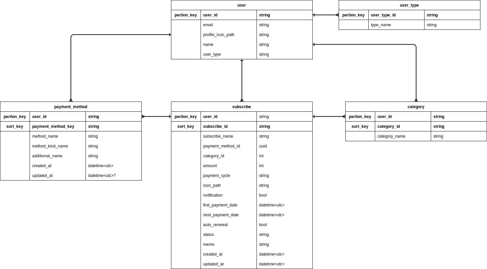

# 設計1

## 技術選定

### バックエンド

#### 言語: Rust

採用理由：

- 開発チームのRust技術スタックの活用
- 高いパフォーマンスと低メモリ消費
- AWS Lambdaとの優れた相性
- コールドスタートが高速
- メモリ使用量が少なく、コスト効率が良い
- コンパイル時の安全性保証

#### フレームワーク・主要ライブラリ

- Axum: 軽量で高速なWebフレームワーク
- tokio: 非同期ランタイム
- async_trait: 非同期トレイト実装
- aws-sdk: AWS サービス連携
- serde: シリアライズ/デシリアライズ
- tracing: ログ管理
- mockall: テスト用モック

### フロントエンド

#### 言語: TypeScript

採用理由：

- 静的型付けによるエラー検出の容易さ
- 充実したIDEサポート
- 大規模なコミュニティと豊富な情報源

#### フレームワーク・主要ライブラリ

- Next.js: Reactベースの高機能フレームワーク
- Deno: Rust製で高速な実行環境
- Tailwind CSS: 効率的なUIスタイリング

### インフラストラクチャ

#### AWS

- Lambda: サーバーレスアーキテクチャによるスケーラブルな実行環境
- DynamoDB: 高速なNoSQLデータベース、シンプルなデータ構造に最適
- Cognito: ユーザー認証・認可の管理
- API Gateway: REST APIエンドポイントの提供
- S3: 画像などの静的アセット保存

#### デプロイ

- Vercel: Next.jsの開発元が提供する最適化されたホスティング環境

ここにマークダウン形式のテキストやリンクを記載する。
※リンクの場合は、リンクを知っている全員が閲覧できるように権限設定してください。

# ユーザーフロー図

# 画面設計図

# 画面遷移図

# ER図

# テーブル定義書

